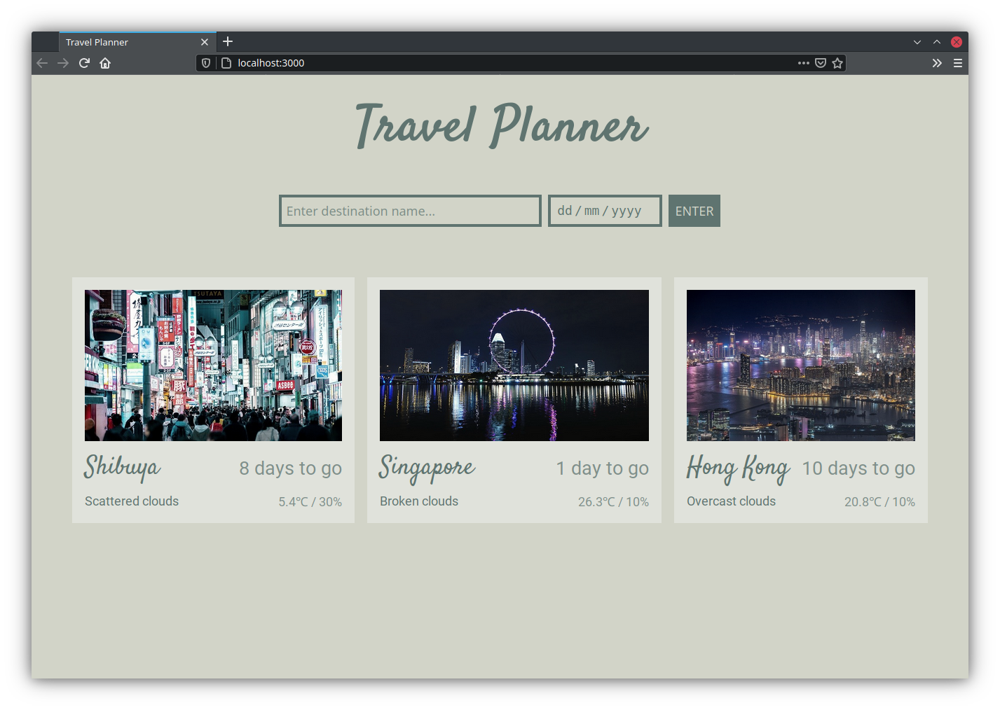

# Travel Planner

A simple app that fetches weather forecasts for your upcoming trip destinations.



## Features

- Add multiple trips
- See countdown of days till trip (hover over countdown to check trip date)
- Fetch picture for country when no suitable picture is found for the specific location
- Responsive design for all screen sizes

## Installation steps

Clone this repository and install packages.

```bash
git clone https://github.com/srijan-nayak/travel-planner.git
cd travel-planner
npm install
```

This app uses APIs provided by [GeoNames](https://www.geonames.org/export/web-services.html),
[Weatherbit](https://www.weatherbit.io/api) and [Pixabay](https://pixabay.com/service/about/api/)
to fetch location data, weather forecast and location pictures respectively.

Add your own API keys to a `.env` file in the project root to access the above mentioned APIs.

```bash
echo GEONAMES_USERNAME=YOUR-GEONAMES-USERNAME > .env
echo WEATHERBIT_API_KEY=YOUR-WEATHERBIT-API-KEY >> .env
echo PIXABAY_API_KEY=YOUR-PIXABAY-API-KEY >> .env
```

## Running dev server

Run the following commands in 2 separate terminals.

```bash
npm start
npm run dev
```

A browser window should automatically open pointing at http://localhost:8080.

## Running in production mode

First build the app then start the server.

```bash
npm run build
npm start
```

Then visit http://localhost:3000 in a browser.

## Running tests

First start the server, then run the tests in a separate terminal.

```bash
npm start
npm test
```
